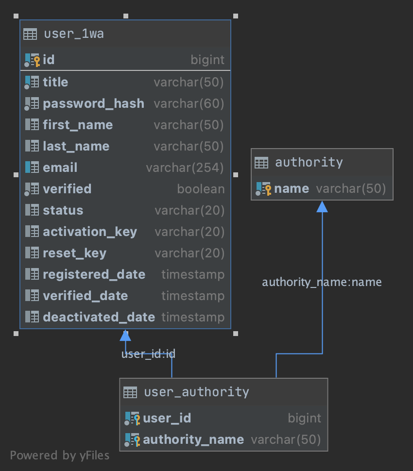

# One World Accuracy
[](https://www.codacy.com?utm_source=github.com&amp;utm_medium=referral&amp;utm_content=macphilips/1wa&amp;utm_campaign=Badge_Grade)

## Requirements

-  [Java 8+](https://www.oracle.com/java/technologies/javase-downloads.html)
-  [Postgres](https://www.postgresql.org/docs/9.4/static/tutorial-install.html)
-  [Docker](https://www.docker.com/get-started) (optional)

## Development

This application was developed using Spring boot for backend and PostgreSQL for persisting data.

### Setup

1.  Install [Java 8+](https://www.oracle.com/java/technologies/javase-downloads.html)
2.  Install [Postgres](https://www.postgresql.org/docs/9.4/static/tutorial-install.html)

Clone this repo

```shell script
$ git clone https://github.com/macphilips/1wa.git
$ cd 1wa
```

Install dependencies

```shell script
$ ./gradlew
```

#### Run the app

Before running the app ensure you have created a database in postgres. The application uses `1wa_db` by default.

You can update the datasource settings in `src/main/resources/application.yml`.

```shell script
$ ./gradlew bootRun
```

To enable sending emails to the users, replace the following placeholder variables in `src/main/resources/application.yml` with the appropriate values.

-  `${SENDGRID_API_KEY}`
-  `${FROM_EMAIL}`
-  `${REPLY_TO_EMAIL}`
-  `${BASE_URL}`


### Running with Docker

To build docker image of the application

```shell script
$ ./gradlew clean bootJar jibDockerBuild
```

Start the application via docker-compose

```shell script
$ docker-compose -f src/main/docker/app.yml up -d 1wa-app
```

We've added a Makefile to execute the above steps with one command.

```shell script
$ make start
```

To stop the application

```shell script
$ docker-compose -f src/main/docker/app.yml down --remove-orphan
```

or

```shell script
$ make stop
```

### Database Schema

